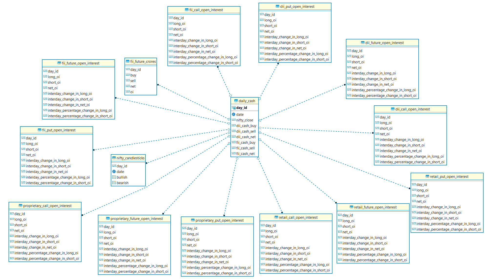
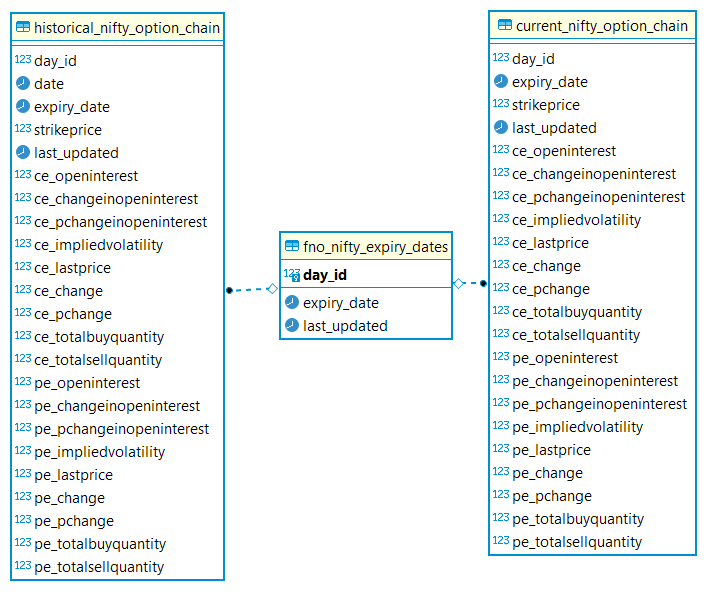

# SensiBear 🐻

## Introduction

The one stop place to wreck my boi Abid's software the useless-bull.\
It is as of now built to provide API service to the data.\
And is just for a parody unless i start seeing some sick profits out of this.

## ER Diagrams

### Database that stores daily data scraped from NSE

   

### Options database(never actually used it tho)

   

## The Backend

Inside backend folder is where majority of the automagic happens.\
To get latest days data we use this:

```sh
cd backend/src/resources/
python main.py
```

This is connected to a lot of files that are in that particular folder.

### Files in resources and their purpose

1. To get yesterday's OI data from DB and compare it to todays fetched data.

   - calculate_change_from_ytd.py
   - yesterdays_data_from_db.py

2. To obtain bullish and bearish candlestick patterns data of the day.

   - get_candlestick_pattern_of_the_day.py

3. Fetch day's FII-DII cash details.

   - get_day_cash_data.py

4. Fetch day's participant wise open interest.

   - get_participant_wise_fao.py

5. Get FII futures data.
   - get_fii_future_cash.py

## API Server
